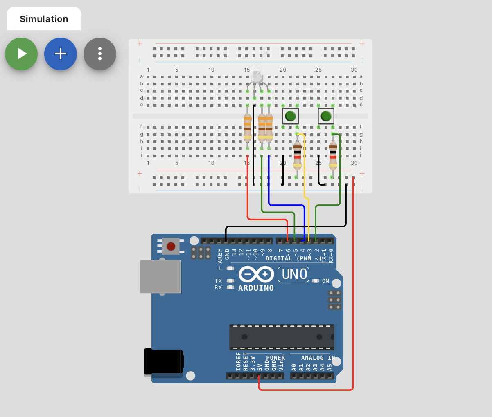

# TypeRacer Game - Arduino

## 1. Descriere
Acest proiect reprezintă un joc de tip TypeRacer, folosind un LED RGB, butoane și alte componente, incluzând debouncing-ul butoanelor. Proiectul este construit folosind un microcontroller **ATMega328P** și API-ul **Arduino**.

### Funcționalități

- **Indicator de stare prin LED RGB:**
În modul de repaus: LED-ul RGB este alb, indicând că jocul este pregătit.
La începutul rundei: LED-ul clipește timp de 3 secunde pentru a indica o numărătoare inversă (3, 2, 1) până la start.
În timpul rundei:
LED-ul devine verde dacă utilizatorul introduce corect cuvintele.
LED-ul devine roșu în cazul unei greșeli, permițând utilizatorului să corecteze înainte de expirarea timpului.

- **Buton Start/Stop:**
În repaus: inițiază o nouă rundă cu o numărătoare inversă de 3 secunde.
În timpul rundei: permite oprirea imediată a jocului la apăsare.

- **Buton pentru selectarea dificultății:**
În modul de repaus, acest buton schimbă dificultatea între nivelurile ușor, mediu și greu.
La fiecare schimbare a dificultății, terminalul va afișa mesajul corespunzător (“Easy/Medium/Hard mode on!”).

- **Generarea cuvintelor:**
Un dicționar de cuvinte este generat și afișat în ordine aleatorie în terminal.
La introducerea corectă a unui cuvânt, următorul cuvânt apare imediat; în caz de greșeală, noul cuvânt apare după un interval stabilit în funcție de dificultate.

- **Scor final:**
La finalul rundei (30 de secunde), în terminal va fi afișat numărul total de cuvinte corecte.

### Proiectul în funcțiune

### Video YouTube 

## 2. Componente utilizate
- **1x LED RGB**: Indică începutul și sfârșitul rundei printr-o animație, dar și corectitudinea fiecărui cuvânt în momentul scrierii
- **2x Butoane**: Start/Stop rundă; Schimbarea dificultății
- **5x Rezistoare**: 3x 330 ohm pentru LED-ul RGB și 2x 1K ohm pentru butoane.
- **Breadboard**: Pentru conectarea circuitelor.
- **Linii de legătură**: Pentru conexiunile pe breadboard.

### Componente utilizate

## 3. Schema electrică
### Diagrama realizată în Wokwi

